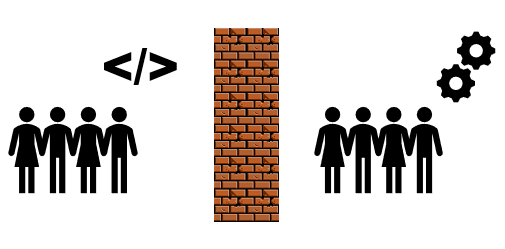
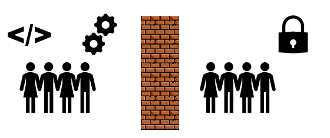
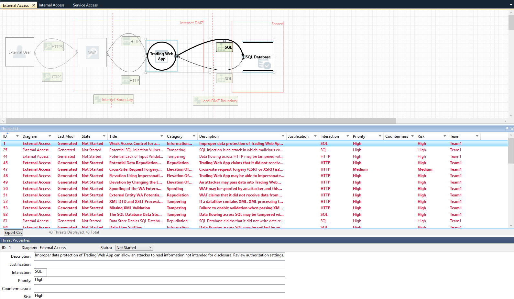

---?color=#222222

### DevSecOps  
##### Scott Storey 

---
### Who Am I?
Scott Storey
@ul [squares](false)
- Security Architect @ Egress Software Technologies
- Associate Lecturer @ Sheffield Hallam University in Cyber Security
- PhD Student @ C3RI (Cultural Communicaiton and Computing Research Institute)
- Research Focus in Sociotechnical Security

---
### Who are you?

By a show of hands how do you identify:
@ul[squares]
- Developer?
- Operations?
- Security?
- DevOps?
- Leader?
- Student?
- Anything else?
@ulend

---?color=#43B291

### Reminder of the dark ages

---
### Wall of Confusion 1.0

---?color=#60FFD0

### Player 3 enters the game

---
### Wall of Confusion 2.0

---?color=#99FFE6

### Why are we making the same mistakes?

---
### Historically...
@ul[squares]
- Security aligned most closely with ops
- Security has never had a settled place
- Security was a backstop to prevent "bad" releases
- People tried to avoid security (and could!)
@ulend

---
### ...today
@ul[squares]
- You can't avoid security
- Interaction has been forced
- Lack of understanding and communication
- Security requirements are  more engrained in law
- Security abusing its position
@ulend

---?color=#60FFD0

### DevSecOps to the rescue!

---
### Security needs to change
@ul[squares]
- Need to work with, not against
- Need to fit how dev and ops work 
- Need to be involved throughout the lifecycle
- Need to be accessible
@ulend

---
### Barriers to adoption
@ul[squares]
- Lack of skilled security professionals
- Lack of dev and ops with security knowledge
- Change is hard! 
@ulend

---?color=#60FFD0

### Moving forward in your organisation

---
### Questions to ask throughout
@ul[squares]
- Is it secure?
- How do you know it's secure?
- Is it more or less secure than previously?
- Would you be happy using it?
@ulend

---
### Security need to provide requirements
@ul[squares]
- Configuration standards
- Coding standards
- Regulatory standards
- Ideally in a format that isn't a 300 page document!
- CIS Benchmarks (and linked tooling) can solve this.
@ulend

---
### Threat Modelling

---
### Threat Modelling
@ul[squares]
- Anybody can pick it up
- Template threat models out the box
- Good collaboration opportunity
- Auto-generate threats
- As capability matures, introduce custom threats
@ulend

---
### Scan as part of builds, not just on deploy
@ul[squares]
- Static Analysis
- Dynamic Analysis
- Vulnerability Scanning
@ulend

---?color=#60FFD0
### DevSecOps Reference Architecture

---

---?color=#60FFD0

### Have a play!

---
### DevSecOps Studio

https://github.com/teacheraio/DevSecOps-Studio

---
### Awesome DevSecOps
@ul[squares](false)
- Part of the awesome series on GitHub
- If you haven't seen the awesome series before, check it out!
@ulend

https://github.com/devsecops/awesome-devsecops

---
### @fa[star] Thank you. Questions? @fa[star]
 
@fa[laptop] : [scottstorey.co.uk](https://www.scottstorey.co.uk) 
@fa[twitter] : [@scottstorey](https://www.scottstorey.co.uk) 
@fa[github] : [sjstore2](https://github.com/sjstore) 
@fa[envelope] : [me@scottstorey.co.uk](mailto:me@scottstorey.co.uk) 
