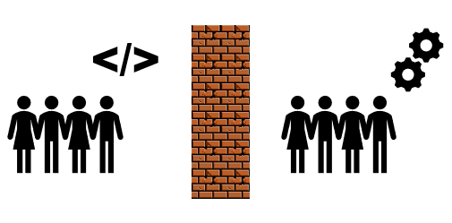

---?color=#222222

### DevSecOps  
##### Scott Storey 

---
### Who Am I?
Scott Storey
@ul [squares](false)
- Security Architect @ Egress Software Technologies
- Associate Lecturer @ Sheffield Hallam University in Cyber Security
- PhD Student @ C3RI (Cultural Communicaiton and Computing Research Institute)
- Research Focus in Sociotechnical Security

---
### Who are you?

By a show of hands how do you identify:
@ul[]
- Developer?
- Operations?
- Security?
- DevOps?
- Leader?
- Student?
- Anything else?
@ulend

---?color=#fc8a00

### Reminder of the problem devops should resolve 

---
### Wall of Confusion 1.0

---?color=#fc8a00

### Player 3 enters the game 

---
### Wall of Confusion 2.0

---
### @fa[star] Thank you. Questions? @fa[star]
 
@fa[laptop] : [scottstorey.co.uk](https://www.scottstorey.co.uk) 
@fa[twitter] : [@scottstorey](https://www.scottstorey.co.uk) 
@fa[github] : [sjstore2](https://github.com/sjstore) 
@fa[envelope] : [me@scottstorey.co.uk](mailto:me@scottstorey.co.uk) 
